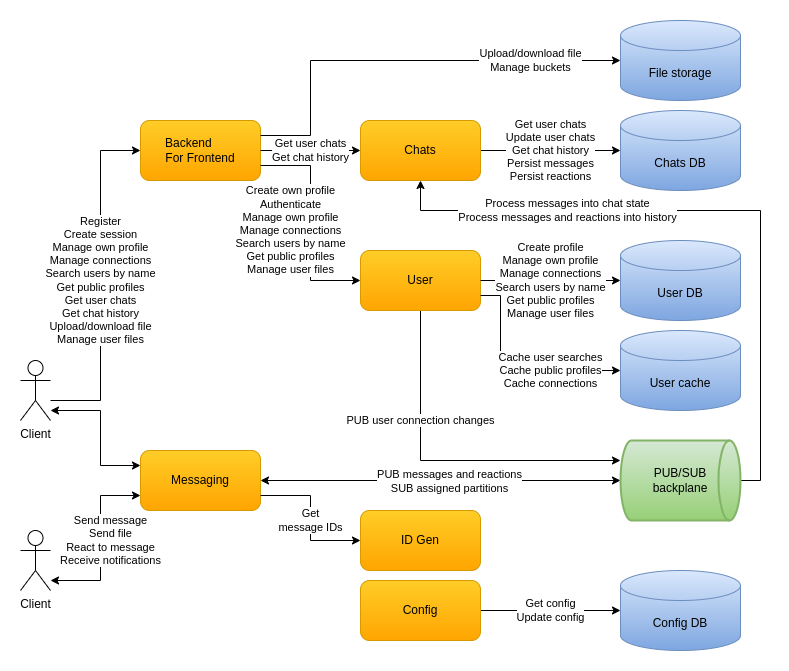

# CecoChat

> A horizontally scalable, real-time chat engine designed for millions of users, built with .NET microservices, Kafka, gRPC, WebSocket, YugabyteDB, Cassandra, Redis, MinIO and OpenTelemetry.

Developed by **Evangelos Vlachos**.

## Table of Contents

- [Capabilities](#capabilities)
- [Architecture](#architecture)
- [Services](#services)
- [Technology Stack](#technology-stack)
- [Repository Structure](#repository-structure)
- [Getting Started](#getting-started)
  - [Prerequisites](#prerequisites)
  - [Certificates](#certificates)
  - [Run infrastructure with Docker](#run-infrastructure-with-docker)
  - [Run the services](#run-the-services)
  - [Run in Minikube](#run-in-minikube)
  - [Build container images](#build-container-images)
  - [Tests](#tests)
- [Documentation](#documentation)
- [CI](#ci)

## Capabilities

- **Real-time messaging**: send and receive messages, send files (images, text, PDF), react and unreact with emojis, multiple clients per user.
- **Chats**: processing notifications, new-message indication, chat history at any point in time.
- **Users**: register, authenticate, change password, edit profile, store small user files.
- **Other users**: search by name, connections (invite, accept, cancel, remove), public profiles.

See [what next](docs/what-next.md) for the planned roadmap.

## Architecture



Clients talk to a **BFF** (backend for frontend) over HTTP/JSON for everything except live chat, and connect directly to a **Messaging** service over WebSocket with MessagePack for sending and receiving messages. Messaging instances exchange traffic through a Kafka **PUB/SUB backplane**, so users connected to different instances can chat with each other. The **Chats** service consumes the backplane and materializes chat state and history into Cassandra. The **User** service owns profiles, sessions and connections in YugabyteDB, with Redis caching. **ID Gen** issues Snowflake message IDs. A central **Config** service provides dynamic configuration and pushes changes to interested services over the backplane.

Cross-cutting concerns are handled uniformly: health checks, distributed tracing, log aggregation and metrics via OpenTelemetry, containerized deployment with Docker and Kubernetes.

## Services

| Service | Role | Protocols | Storage |
|---|---|---|---|
| **BFF** | Public HTTP API for clients, aggregates the other services | HTTP/JSON, gRPC | - |
| **Messaging** | Real-time chat sessions, fan-out through the backplane | WebSocket/MessagePack, Kafka | - |
| **Chats** | Chat state and history projections | gRPC, Kafka | Cassandra |
| **User** | Profiles, authentication, connections, file metadata | gRPC, Kafka | YugabyteDB, Redis, MinIO |
| **ID Gen** | Snowflake ID generation | gRPC | - |
| **Config** | Dynamic configuration with change notifications | gRPC, Kafka | YugabyteDB |
| **Console client** | Minimal functional client for manual testing | HTTP, WebSocket | - |
| **Load tester** | Simulates many concurrent users | WebSocket | - |

## Technology Stack

- **Integration**: Kafka, gRPC, WebSocket (SignalR), HTTP, Protocol Buffers, MessagePack
- **Data storage**: YugabyteDB, Cassandra, MinIO, Redis
- **Operations**: OpenTelemetry, Jaeger, Prometheus, Grafana, ElasticSearch, Kibana, Docker, Kubernetes (Minikube)
- **Services**: .NET 8, ASP.NET Core, SignalR, EF Core
- **Libraries**: Autofac, Serilog, FluentValidation, AutoMapper, Polly, IdGen
- **Testing**: NUnit, Testcontainers, FluentAssertions, Coverlet

All chosen technologies are cloud-agnostic, so the solution does not depend on a specific cloud provider.

## Repository Structure

```
.
├── source/                     # .NET solution
│   ├── CecoChat.sln
│   ├── CecoChat.Bff.*          # BFF service, contracts
│   ├── CecoChat.Messaging.*    # Messaging service, client, contracts
│   ├── CecoChat.Chats.*        # Chats service, data, client, contracts, tests
│   ├── CecoChat.User.*         # User service, data, client, contracts
│   ├── CecoChat.IdGen.*        # ID Gen service, client, contracts, tests
│   ├── CecoChat.Config.*       # Config service, data, client, contracts
│   ├── CecoChat.Backplane      # Kafka backplane abstractions
│   ├── CecoChat.Server         # Shared service hosting
│   ├── CecoChat.ConsoleClient  # Console client
│   ├── CecoChat.LoadTester     # Load testing tool
│   ├── Common.*                # Shared infrastructure (AspNet, Cassandra, Kafka, Npgsql, Redis, Minio, OpenTelemetry, Testing)
│   ├── Check.*                 # Connection-limit and hashing experiments
│   └── certificates/           # Scripts to generate and trust the dev TLS certificate
├── deploy/
│   ├── docker/                 # docker compose files per component, start/stop scripts
│   ├── minikube/               # Kubernetes manifests and Helm values for Minikube
│   └── testing/                # Load-test deployment
├── package/cecochat/           # Dockerfiles and build script for the service images
└── docs/                       # Design, research, development and load-test documentation
```

## Getting Started

### Prerequisites

- [.NET 8 SDK](https://dotnet.microsoft.com/download)
- [Docker](https://www.docker.com/) with Docker Compose
- A machine with plenty of RAM. The full local stack runs Kafka, YugabyteDB, Cassandra, Redis, MinIO and the observability tools.
- Optional: [Minikube](https://minikube.sigs.k8s.io/) and `kubectl` for the Kubernetes deployment

### Certificates

Both the .NET services and the Minikube ingress use TLS. Certificates are git-ignored and must be generated after cloning.

```bash
cd source/certificates
./create-certificate.sh
./trust-certificate.sh
```

On Windows or other systems, generate a certificate with your own tooling and include the domains listed under `[ alt_names ]` in `source/certificates/services.conf`. See [local run prerequisites](docs/dev-run-prerequisites.md) for details.

### Run infrastructure with Docker

Create the Docker volumes first using the `docker-volume.sh` script in each component folder under `deploy/docker` (Kafka, Cassandra, YugabyteDB, Redis, MinIO, Logging). Then start the main infrastructure:

```bash
cd deploy/docker
./start-main.sh          # kafka, cassandra, yugabyte, redis
./start-telemetry.sh     # otel collector, logging, metrics, tracing
```

Or pick only what you need, for example:

```bash
docker compose -f kafka.yml up -d
docker compose -f yugabyte.yml up -d
docker compose -f cecochat-config.yml up -d
```

Stop everything with `./stop-main.sh` and `./stop-telemetry.sh`.

### Run the services

All services depend on the Config service, so start it first. Then run the others from the IDE or the terminal, for example:

```bash
cd source/CecoChat.Config.Service && dotnet run
cd source/CecoChat.IdGen.Service && dotnet run
cd source/CecoChat.Messaging.Service && dotnet run
cd source/CecoChat.Chats.Service && dotnet run
cd source/CecoChat.User.Service && dotnet run
cd source/CecoChat.Bff.Service && dotnet run
```

Ports for each service are listed in `source/server-addresses.txt`. The Messaging service has two launch profiles so two instances can run side by side to simulate users connected to different nodes. Use the console client in `source/CecoChat.ConsoleClient` to chat. Full instructions are in [local run in Docker](docs/dev-run-docker.md).

### Run in Minikube

For a production-like Kubernetes environment, follow [local run in Minikube](docs/dev-run-minikube.md). Manifests live in `deploy/minikube`.

### Build container images

```bash
cd package/cecochat
./build-all-images.sh
```

Point your shell to the right Docker daemon first (for Minikube, apply `minikube docker-env`).

### Tests

```bash
cd source
dotnet test CecoChat.sln
```

Integration tests use Testcontainers, so Docker must be running.

## Documentation

- **Intro**: [capabilities](docs/intro-capabilities.md), [overall design](docs/intro-design.md), [technologies](docs/intro-technologies.md)
- **Research**: [concurrent connections limit](docs/research-connection-limit.md), [calculations](docs/research-calculations.md), [messaging traffic](docs/research-messaging-traffic.md), [message IDs](docs/research-message-ids.md), [reliable messaging and consistency](docs/research-reliable-messaging-consistency.md)
- **Design**: [messaging](docs/design-messaging.md), [chats](docs/design-chats.md), [users](docs/design-users.md), [clients](docs/design-clients.md), [configuration](docs/design-configuration.md), [observability](docs/design-observability.md), [deployment](docs/design-deployment.md)
- **Development**: [prerequisites](docs/dev-run-prerequisites.md), [Docker](docs/dev-run-docker.md), [Minikube](docs/dev-run-minikube.md), [process](docs/dev-process.md)
- [Load test using 2 machines](docs/load-test.md)
- [What next](docs/what-next.md)

Diagrams are in `docs/diagrams` and open with [draw.io](https://app.diagrams.net/).

## CI

GitHub Actions workflows in `.github/workflows` build the solution, enforce the `.editorconfig` code style with `dotnet format`, run SonarCloud analysis, and build and push the service images to Docker Hub under the `evangelosvlachos96/` namespace. Set the `SONAR_TOKEN` and Docker Hub secrets in the repository settings before enabling them.
